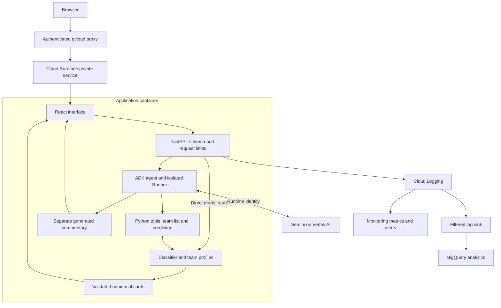
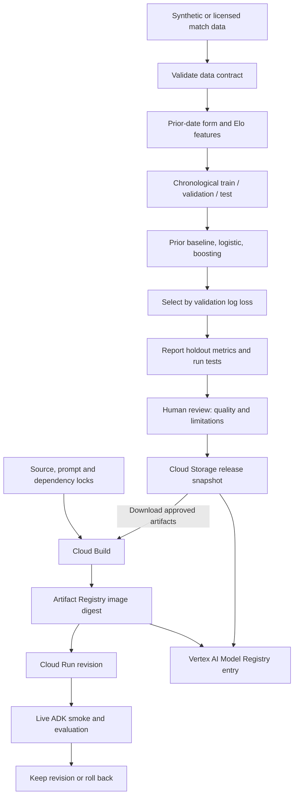

# MatchMind ADK architecture

## Online request path — implemented

The authenticated proxy is a recording/development access method. A commercial frontend
would need a customer identity design; do not expose the agent anonymously just to film it.
ADK is a Python framework inside Cloud Run, not a separately deployed foundation model.
The classifier uses CPU inference in that same container. Gemini is a managed API dependency.

## Offline training and deployment path — implemented scripts

The human review and live-check gates are manual in this tutorial. Do not claim they are
enforced by a CI/CD approval system. Model Registry registration does not start training,
create a prediction endpoint or automatically approve the model.

## Responsibility map for an AI/MLE lead

| Owner | Deliverable | Question the lead should ask |
|---|---|---|
| Data engineering | Validated, licensed snapshot | Can any feature use information unavailable at prediction time? |
| Data science | Baselines, features and evaluation | Does this outperform simple outcome frequencies on later data? |
| ML engineering | Versioned artifact and serving contract | Can we reproduce and roll back the exact estimator and preprocessing? |
| AI engineering | ADK tools, prompt and evaluation | Can the agent select the wrong fixture or invent an unsupported action? |
| QE | Failure, contract and behavioural tests | What is simulated, and what was tested against the live model? |
| Platform/SRE | IAM, image delivery and observability | Which identity can access each dependency, and what alerts reach an owner? |
| Product/governance | Intended use and release decision | Do users see the data cut-off, uncertainty and limitations? |

## Why no RAG, CAG or Terraform here?

The prediction features are structured numbers. No document knowledge base is needed for
the current job. Caching stable context would only be justified by measured reuse, latency
and cost. Terraform would help reproduce infrastructure across team environments, but the
numbered gcloud commands teach the same underlying resources with less initial setup.
